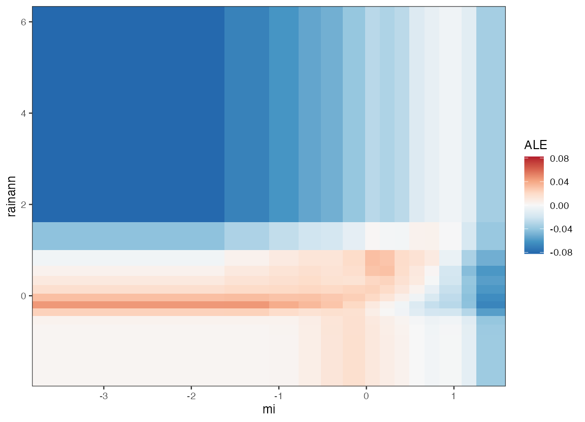

# curves 

[](https://github.com/rvalavi/curves/actions)
[](https://lifecycle.r-lib.org/articles/stages.html#experimental)

**curves** is an experimental R package for plotting response curves from
fitted models with **ggplot2**. The package is intentionally small and
model-agnostic: supply a fitted model, predictor data, and, when needed, a
custom prediction function.


The figure above shows partial dependence curves from the included random
forest species distribution vignette.

## Current package scope

The current API is centred around three exported functions:

- `univariate()` for one-predictor response curves with
  `method = "profile"`, `"pdp"`, `"ice"`, `"ice+pdp"`, or `"ale"`.
- `bivariate()` for two-predictor response surfaces as static heatmaps,
  filled contours, or interactive 3D `plotly` surfaces.
- `multimodel()` for averaged univariate curves across multiple fitted
  models, with an optional standard deviation ribbon.

A few practical details are worth calling out:

- Predictor inputs can be ordinary data frames or `terra::SpatRaster`
  objects.
- Numeric and factor predictors are supported. For `method = "ale"`, factor
  predictors are currently ignored with a warning and only numeric predictors
  are plotted.
- If `predict()` returns multiple columns, `response` can be used to choose
  the column to plot.
- Static plots return `ggplot2` objects, so they can be styled or combined in
  downstream workflows.

## Installation

`curves` is not on CRAN. Install the development version from GitHub:

```r
install.packages("remotes")
remotes::install_github("rvalavi/curves")
```

Optional packages:

- `terra` for raster-backed predictor inputs.
- `plotly` for interactive 3D surfaces.
- `randomForest` and `disdat` for the species distribution vignette.

## Quick start

```r
library(curves)

model <- lm(
  Sepal.Length ~ Sepal.Width + Petal.Length + Petal.Width,
  data = iris
)

predictors <- iris[, c("Sepal.Width", "Petal.Length", "Petal.Width")]

# Single-profile response curves
univariate(model, predictors)

# Partial dependence curves
univariate(model, predictors, method = "pdp", n = 50)

# Accumulated local effects curves
univariate(model, predictors, method = "ale", n = 40)

# Bivariate response surface
bivariate(
  model,
  predictors,
  pairs = c("Sepal.Width", "Petal.Length"),
  plot_type = "heatmap"
)
```

For model comparisons, pass a list of fitted models to `multimodel()`. If a
model needs non-default prediction arguments, pass them through `...`. If it
returns multiple prediction columns, either set `response` or provide a small
wrapper through `fun`.

## Species distribution vignette

The package includes a fuller
[species distribution vignette](vignettes/random-forest-species-distribution.Rmd)
built around a down-sampled random forest classifier. It demonstrates:

- class-probability plots with `response = "1"`
- profile, PDP, ICE, and ALE workflows through `univariate()`
- a bivariate heatmap and optional 3D surface

You can open it after installation with:

```r
vignette("random-forest-species-distribution", package = "curves")
```


