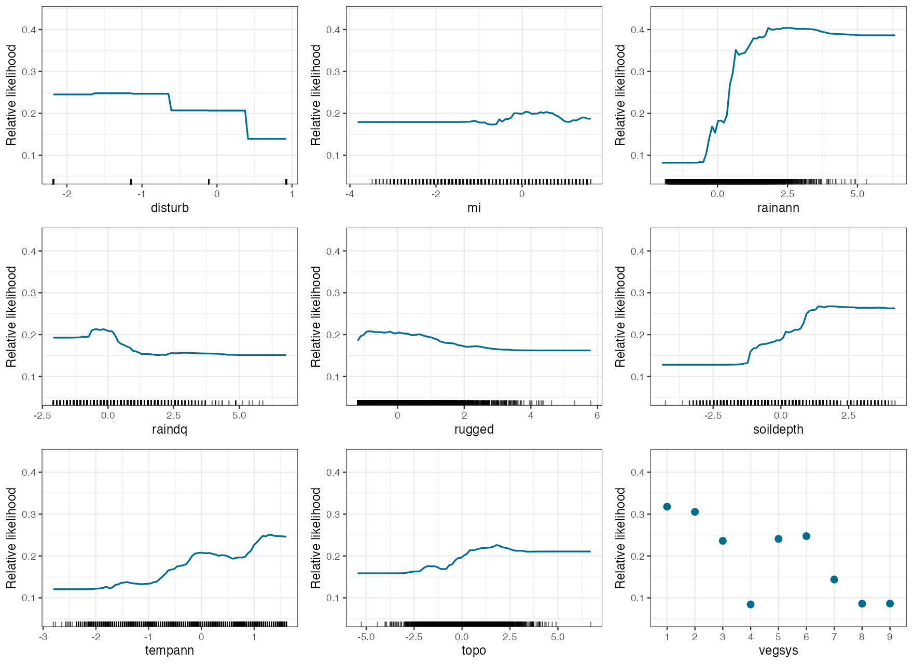
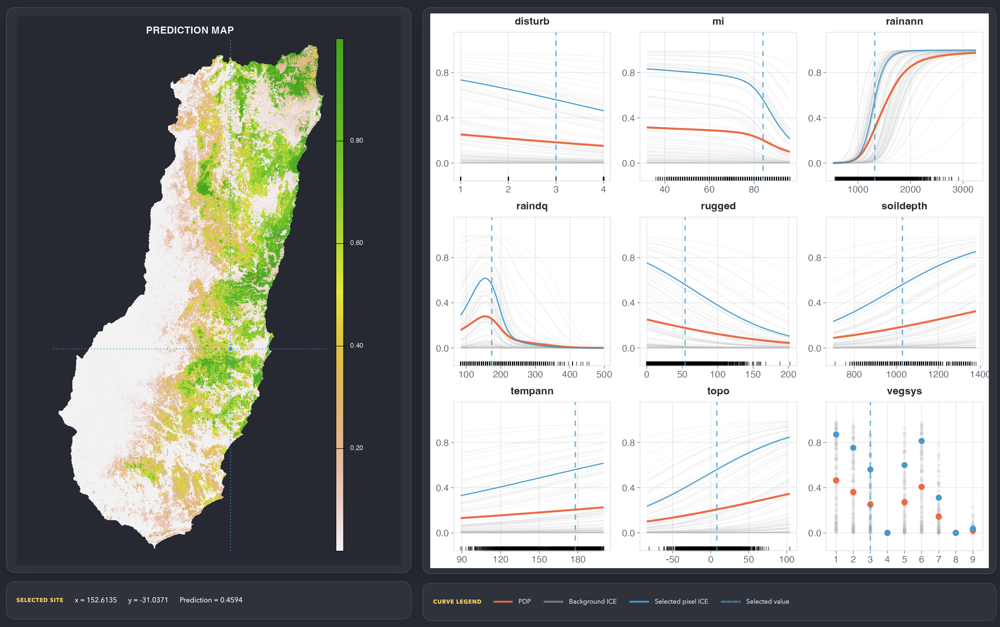

# curves 

[](https://github.com/rvalavi/curves/actions)
[](https://CRAN.R-project.org/package=curves)

**curves** is an experimental R package for plotting response curves from
fitted models with **ggplot2**. The package is intentionally small and
model-agnostic: supply a fitted model, predictor data, and, when needed, a
custom prediction function.



The figure above shows partial dependence curves from the included species
distribution vignette.

## Current package scope

The current API is centred around five exported functions:

- `univariate()` for one-predictor response curves with
  `method = "profile"`, `"pdp"`, `"ice"`, `"ice+pdp"`, or `"ale"`.
- `bivariate()` for two-predictor profile, PDP, or ALE surfaces as static
  heatmaps, filled contours, or interactive 3D `plotly` surfaces.
- `interactions()` for ranking numeric predictor pairs by the strength of
  their centred second-order ALE interaction surfaces.
- `multimodel()` for ensemble profile, PDP, or ALE curves across multiple
  fitted models, with optional interval ribbons and member-model overlays.
- `mapcurve()` for Shiny-based exploration that links a
  prediction raster to response curves at clicked map cells.

A few practical details are worth calling out:

- Predictor inputs can be ordinary data frames or `terra::SpatRaster`
  objects.
- Numeric and factor predictors are supported. Univariate ALE summaries now
  support both numeric and factor predictors, while bivariate ALE remains
  limited to numeric predictor pairs.
- If `predict()` returns multiple columns, `response` can be used to choose
  the column to plot.
- Static plots return `ggplot2` objects, so they can be styled or combined in
  downstream workflows.

In short, profile curves use one reference row, PDP averages predictions over
sampled rows, ICE keeps those row-level curves visible, and ALE accumulates
local prediction differences within the observed predictor distribution.

## Installation

`curves` is not on CRAN. Install the development version from GitHub:

```r
install.packages("remotes")
remotes::install_github("rvalavi/curves")
```

Optional packages:

- `terra` for raster-backed predictor inputs.
- `plotly` for interactive 3D surfaces.
- `mgcv` for the GAM ensemble example below.
- `randomForest` and `disdat` for the species distribution vignette.

## Quick start

```r
library(curves)

model <- lm(
  Sepal.Length ~ Sepal.Width + Petal.Length + Petal.Width,
  data = iris
)

predictors <- iris[, c("Sepal.Width", "Petal.Length", "Petal.Width")]

# Partial dependence curves (default)
univariate(model, predictors)

# Single-profile response curves
univariate(
  model,
  predictors,
  method = "profile"
)

# Accumulated local effects curves
univariate(model, predictors, method = "ale", n = 40)

# Bivariate response surface
bivariate(
  model,
  predictors,
  pairs = c("Sepal.Width", "Petal.Length"),
  background_n = 50,
  rug = TRUE,
  plot_type = "heatmap"
)

# Rank pairwise ALE interactions
interactions(model, predictors, n = 10)

# Plot only the strongest ALE surfaces
bivariate(model, predictors, method = "ale", top_n = 3, n = 10)
```

For ensemble modelling or repeated-fit comparisons, pass a list of fitted
models to `multimodel()`. This is useful not only for formal ensembles, but
also for cross-validation folds, bootstrap or bagged refits, and models fit
with different background samples or closely related training sets. The models
should share compatible predictors, and their predictions should be on the
same response scale. If a set of models shares the same prediction interface,
pass non-default prediction arguments through `...`. For mixed model types,
supply `fun` as a list of wrappers, one per model. If a shared prediction
function returns multiple prediction columns, either set `response` or provide
a small wrapper through `fun`. Use `agg`, `weights`, `interval`, and
`show_models` to control how the model curves are combined and displayed.

```r
models <- list(
  lm(Sepal.Length ~ Sepal.Width + Petal.Length, data = iris),
  mgcv::gam(Sepal.Length ~ s(Sepal.Width) + s(Petal.Length), data = iris)
)

multimodel(
  models,
  predictors[, c("Sepal.Width", "Petal.Length")],
  background_n = 200,
  show_models = TRUE
)
```

## Species distribution vignette

The package includes a fuller
[species distribution vignette](vignettes/random-forest-species-distribution.Rmd)
built around a down-sampled random forest classifier. It demonstrates:

- presence-class response plots with `response = "1"`
- profile, PDP, ICE, and ALE workflows through `univariate()`
- bivariate profile, PDP, and ALE surfaces with an optional 3D surface

You can open it after installation with:

```r
vignette("random-forest-species-distribution", package = "curves")
```

## Interactive map-linked curves

`mapcurve()` opens a Shiny explorer that links a predicted map
to fitted response curves. Clicking a raster cell marks that site's predictor
values on the curve panels, which helps compare local conditions with profile,
PDP, ICE, or ALE summaries.


